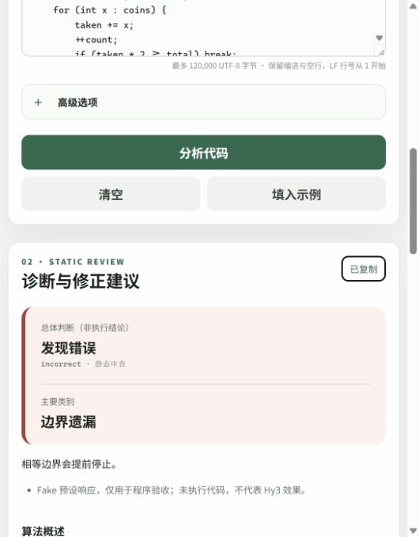

# 两分钟演示脚本与素材

**当前版本是 Mock/Fake 程序演示，非现场 Hy3 调用，也没有真实结果回放。**
本机未发现 ffmpeg；现有浏览器工具提供截图而非视频录制，因此本轮交付脚本、截图和复现步骤，
尚缺视频/GIF成片。不要把截图当作满足视频交付要求。

## 准备

按 [交互文档](interactive-diagnosis-demo.md#fake-网页检查零费用) 构建并启动：
~~~text
build/Release/interactive_server_tests.exe --serve-fake . experiments/interactive/runs/v2/demo-fake-new 8091
~~~
Linux可执行路径为build/interactive_server_tests。使用新的运行目录，页面必须显示Mock/Fake。
不启动生产服务，不读取Key。录制结束Ctrl+C停止本次测试服务。

## 110秒镜头表

| 时间 | 操作 | 旁白重点 |
| --- | --- | --- |
| 0–15s | 顶部Fake标识，填入示例 | 仅完整题面和C++代码必填，思路可选 |
| 15–35s | 点击分析，显示发现错误 | 这是预设响应，用于验证程序，不证明模型效果 |
| 35–55s | 展开算法步骤/代码证据 | 首错逻辑步骤s3，对应第16行；行号片段由后端核对 |
| 55–75s | 展开反例和完整解法 | 反例/解法未执行；模型解释不是证明 |
| 75–95s | 打开固定答案证据和报告 | 8参考通过，25候选10通过15输出错误；不是Hy3准确率 |
| 95–110s | 显示报告限制及待审表 | 账户条件、真实实验、人工复核和成片仍待补齐 |

网页仍展示v2解法说明；评测v1另有完整源码字段，当前不是网页自动执行功能。
未来真实结果可用时录制新版本，并明确“已保存真实结果回放”，不伪称实时调用。

## 实际截图素材

下图来自已完成的M1浏览器Fake检查，只展示页面片段，没有密钥、用户路径或真实响应。
完整页截图存在拼接重复，未作为交付素材使用。

本素材不是模型质量证据。可复现的六场景和复制功能限制见M1记录。
