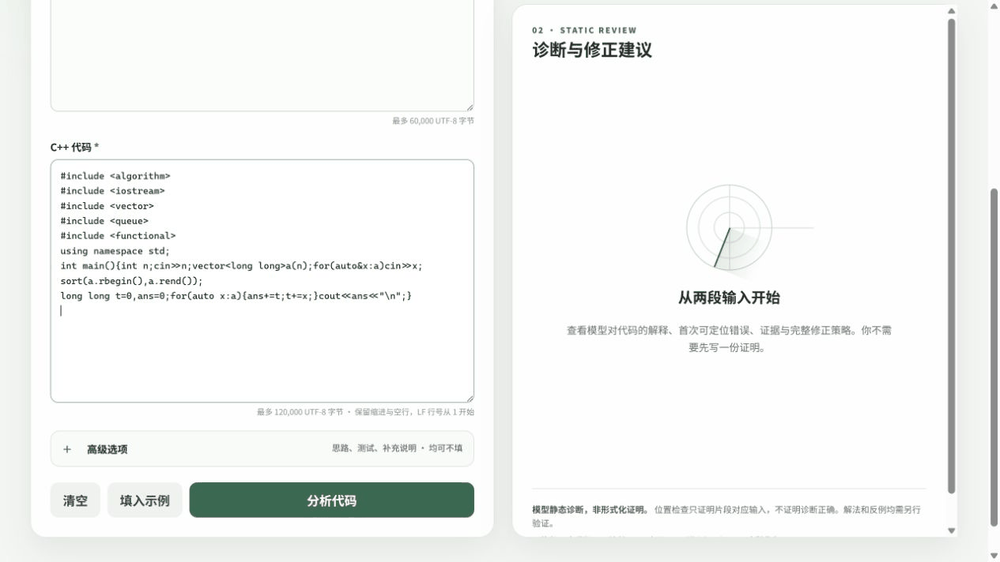

# 94 秒真实 Hy3 结果回放



- 文件：[`docs/assets/hy3-algotrace-real-replay.gif`](assets/hy3-algotrace-real-replay.gif)
- 实测：1265×712、4帧、94秒、约525 KiB。
- 数据：正式冻结样本 s005 的已保存、契约有效 Hy3 响应；没有为演示新增模型调用。
- 标识：页面始终显示“真实 Hy3 结果回放 · 零新增调用”，不冒充现场请求。
- 内容：两框输入、总体诊断、算法步骤、第8行首次错误、反例、完整修正解法、固定测试与正式指标。
- 边界：网页不执行代码；演示中的参考代码执行结论来自另行批准的无网络 bubblewrap 固定测试。有限测试与静态分析均非形式化证明。

## 可复现检查

构建 `interactive_server_tests` 后，可用公开脱敏记录启动只读回放服务：

```powershell
build/Release/interactive_server_tests.exe --serve-replay `
  . build/demo-real-replay 8092 `
  evaluation/results/formal-20260909-records.json
```

打开 `http://127.0.0.1:8092/`，填入 s005 的公开题面和候选代码后点击“分析代码”。该入口只回放 s005 的保存结果；不会读取 Key、访问网络或执行输入代码。它属于演示/测试入口，不是生产模型客户端。

## 验证记录

2026-09-09 使用本地 loopback 回放检查：健康端点为 `model_mode=recorded_replay`、`code_execution=false`、`online_judge=false`。浏览器实际显示诊断、算法步骤、代码位置、反例与完整解法；三张关键截图和一张指标页组合为成片。成片没有密钥、账户信息、provider request ID 或本地绝对路径。
