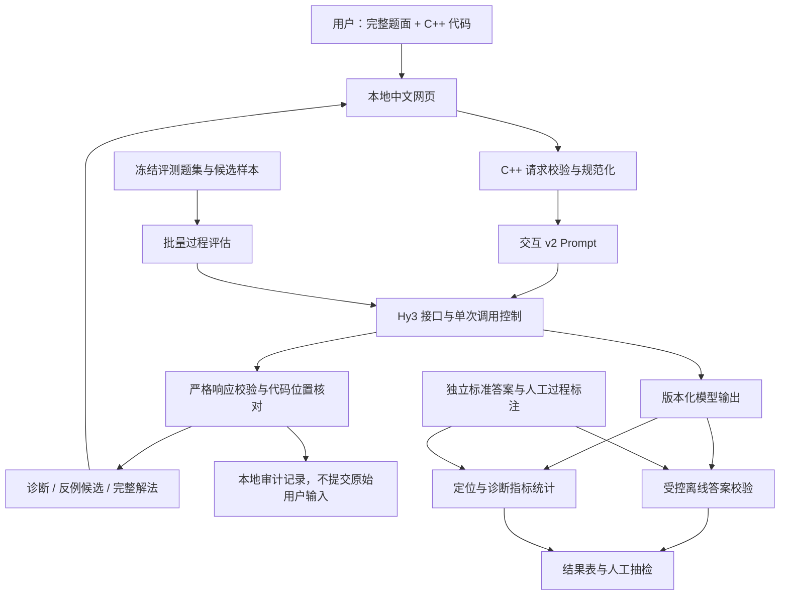

# hy3-algotrace 项目方案

## 基于 Hy3 的贪心算法代码诊断与过程评估

| 项目项 | 内容 |
| --- | --- |
| 提交节点 | 2026 年 8 月 27 日方案文档 |
| 对应任务 | 犀牛鸟开源实战任务 2：可验证场景——过程评估与错误定位 |
| 项目性质 | 个人开源实践 / 活动作品，非腾讯、混元或 Codeforces 官方项目 |
| 项目仓库 | [Smily2333/hy3-algotrace](https://github.com/Smily2333/hy3-algotrace) |
| 核心模型 | Hy3，通过现有 TokenHub 接口调用，不训练或微调模型 |
| 技术基础 | C++17 后端、原生 HTML/CSS/JavaScript 前端、CMake 构建 |
| 方案版本 | v1.1；实现状态以 2026-08-27 核查的 `f21359f` 为基线；已补充独立执行路线图 |

> **方案摘要：** 面向算法学习者，提供“粘贴完整题面与 C++ 代码，即可获得错误位置、原因、反例候选和完整修正解法”的轻量应用。项目首先覆盖贪心题，复用已完成的 Hy3 接口、本地网页与离线评测工具，将剩余工作集中在代码优先诊断、步骤定位和小规模可信评测。本文件描述拟交付方案；其中交互 v2、正式分层评测和人工抽检尚未完成。

**执行入口：** [当前执行路线图：M1–M4](roadmap.md)。M 代表 Milestone（里程碑）：M1 为轻量诊断应用，M2 为评测材料准备，M3 为效果验证与分析，M4 为最终交付。路线图独立写明背景、现状、各阶段任务、验收与停止条件，接手者不需要读取任何其他聊天记录。

## 1. 场景与目标

### 1.1 待解决的问题

算法学习者遇到错误代码时，往往只知道“某个样例不对”或“未通过评测”，却不知道问题来自题意理解、贪心策略、证明、边界处理还是代码实现。即使现有测试通过，也可能存在遗漏条件或仅在特定输入上碰巧正确的情况。

本项目服务于使用 C++ 学习算法、练习竞赛题的学生与自学者。输入应尽可能简单：完整题面与待诊断代码为必填项，解法思路、测试数据和补充说明为可选项。输出应能帮助用户理解并修正错误，而不止返回一个“正确 / 错误”标签。

Hy3 负责理解自然语言题意、解释代码中的算法逻辑、审查正确性依据并组织诊断说明。确定性程序负责输入校验、结构化响应校验、代码位置核对、固定题集的答案检查与指标统计。模型判断和程序验证各有独立证据，避免由模型同时生成结论并自证正确。

### 1.2 本版目标与边界

本版交付一个可运行的本地中文网页应用，以及支持其有效性分析的评测材料：

- **产品目标：** 题面 + C++ 代码 → 算法概述、错误步骤、代码位置、原因、反例候选和完整参考 / 修正解法。
- **评估目标：** 分开判断答案是否正确、过程是否成立，并验证错误定位与误报情况。
- **交付目标：** 公开源码、运行说明、分层样本、校验工具、实验结果、人工抽检记录和两分钟以内 Demo。

首版限定贪心算法题。网页只进行模型静态审查，不编译运行用户提交的任意代码，不连接外部 OJ，不提供公网多用户服务。自动算法路由、其他算法类型、通用 CandidateRunner、完整沙箱、置信度校准和模型训练均不纳入本次交付。

## 2. 设计思路与用户流程

### 2.1 用户交互

1. 用户粘贴完整题面，包含目标、约束和输入输出说明。
2. 用户粘贴 C++ 代码；如有解法思路或测试，可在高级选项补充。
3. 服务端校验输入并调用一次 Hy3；鉴权、超时或解析失败明确显示，不自动重试。
4. 默认展示总体判断、首次可定位错误、代码片段、原因和修改建议。
5. 用户可展开反例候选与完整解法说明，查看策略、正确性理由、复杂度和关键边界。

题面不要求按标题、输入格式、输出格式、约束拆开填写。缺少思路不能成为自动判错的原因；若题目信息不足或超出支持范围，应说明缺失信息或返回“无法确定”。

### 2.2 结果表达

| 输出内容 | 设计要求 |
| --- | --- |
| 总体判断 | 展示“未发现明确错误 / 发现错误 / 无法确定”，不将静态审查包装成正确性证明 |
| 算法概述 | 根据代码概括所用方法，明确标注为模型解释，不冒充用户原始推理 |
| 步骤与位置 | 简短有序步骤、步骤 ID、代码行号或范围及对应片段 |
| 首次错误 | 指向算法逻辑中错误开始的位置；无法可靠定位时留空并解释，不等同于最小行号 |
| 错误证据 | 题意条件、对应代码和推导说明，区分根本原因与后续影响 |
| 反例候选 | 给出输入、标准结果与预计错误表现的依据；未执行时明确标注“静态推断、未验证” |
| 完整解法 | 参考或修正策略、正确性理由、复杂度、关键边界；需要答案校验的评测输出同时保留 C++ 实现 |

完整解法是面向用户的可检查说明，不是模型内部推理的记录。若无法可靠生成，保留失败或无法确定状态，不填充虚构证明。

### 2.3 示例：严格不等式错误

以“拿走最少硬币，使拿走的总价值严格大于剩余价值”为例，代码若使用 `taken * 2 >= total`，会错误接受恰好一半的情况。

对于面值 `[5, 5]`，取一枚后 `taken * 2 == total`，错误条件会停止；但 5 并不严格大于剩余的 5，因此需要取两枚。理想诊断应定位停止条件，说明 `>=` 与严格大于的差异，并给出修正理由。

该例用于说明目标行为。现有 Demo 的一次真实 Hy3 调用曾漏判此问题，因此不能将此示例当作模型已经具备该能力的证明。

## 3. 系统架构

### 3.1 两条独立处理路径

上图为目标架构。现有系统已具备接口、网页、严格响应解析和旧版离线评测管线；交互 v2、代码位置核对、新评测适配及受控离线答案校验属于后续工作。评测金标准只用于校验和统计，不进入代码优先诊断请求。

### 3.2 模块职责与实现基础

| 模块 | 职责 | 当前状态 |
| --- | --- | --- |
| 原生网页 `web/` | 输入、请求提交、结果与异常展示 | 已有；待改为两个主要输入框及新结果视图 |
| `InteractiveDiagnosis` | 请求解析、Prompt 渲染、结果校验与审计 | 已有 v1；待升级代码优先契约 |
| `Hy3ModelClient` / transport | 服务端凭证、HTTP 请求、超时与安全错误处理 | 已实现，已有真实调用记录 |
| 本地 HTTP 服务 | loopback 监听、健康检查、诊断接口与静态资源 | 已实现 |
| 离线 Exporter / Importer / Reporter | 样本投影、原始响应导入、旧版指标汇总 | 已实现；新模式需要独立适配 |
| 位置核对与步骤关联 | 核对代码范围、片段和步骤引用 | 待实现 |
| 固定题集答案校验 | 用参考解法和固定测试独立验证输出 | 待实现；不开放任意代码执行服务 |
| 人工抽检与分析 | 审核过程标签、首次错误、真实问题与误报 | 待开展 |

### 3.3 技术选型理由

采用 C++17 是为了复用已有服务、校验器和评测实现，而非要求模型诊断应用必须用 C++ 编写。网页沿用原生 HTML/CSS/JavaScript，减少依赖和部署步骤。

CMake 只负责组织本项目源码、依赖与测试的构建；它不是编译器，也不为用户提交的代码创建运行环境。Windows transport 使用 WinHTTP，Linux 使用 libcurl；当前构建和接口方案沿用已有实现，不在本阶段迁移后端语言或重建网络层。

## 4. 重点技术与质量控制

### 4.1 代码优先的 Prompt 与版本隔离

现有交互 v1 以用户思路为主、代码为可选项。新交互 v2 改为以题意和代码为主，思路仅作补充。请求契约、输出 schema、默认模板路径、模板 ID 和哈希必须同步更新。

旧版数据、`hy3-evaluator-v1`、Phase 2 协议、指标和 9 条 pilot 结果保持冻结。新结果使用独立版本和运行标识，不直接与旧 `reference_assisted` 模式的数值混合比较。

### 4.2 过程诊断与分类适用条件

复用题意理解、贪心选择、证明、复杂度、边界和实现一致性等已有分析维度，但不要求每次都报告所有类别：

- 用户没有填写证明，不等于代码错误，不据此报告“缺少贪心证明”。
- 用户没有提供思路时，不以模型自行推测的思路为标准报告“实现与思路不一致”。
- 用户提供了错误思路，即使代码与其一致，也应继续核对题意。
- 如旧分类无法表达明确的代码逻辑错误，只在 v2 中做必要扩展并记录映射，不修改旧实验标签。

标注和统计应区分首次根因与后续连锁表现，避免把同一缺陷拆成大量 findings 后误认为诊断质量更高。

### 4.3 步骤定位与可追溯证据

输入统一换行为 LF，同时保留代码缩进和空行。响应中的代码行号采用 1-based 编号，并核对范围合法性、代码片段与对应行的一致性，以及步骤引用是否存在。重复代码片段不能只依靠全文子串匹配定位。

程序检查的是“引用确实对应输入”，并不证明模型解释正确。正式定位评估将输出映射到人工预先标注的代码范围和逻辑步骤；不能直接比较不同模型响应随机生成的步骤 ID，也不能把两者同属“边界阶段”算作精确命中。

### 4.4 自动答案校验与安全边界

网页不执行用户代码。评测阶段另设固定题集的离线工具，只处理维护者预先审查、批准的参考实现、候选实现和待验证的 Hy3 输出，采用固定编译选项、时间与资源限制，保存测试输入、参考输出及实际输出。

模型生成的代码仍视为不可信输入，不能由评测脚本收到后直接在日常主机运行。运行前须审查，并在无密钥、无网络、权限受限的隔离环境执行；无法提供合适环境时先完成其他工作，将动态验证列为未完成项。离线受控执行不等于已建成通用安全沙箱。

有限测试通过只能表述为“通过指定测试集”，不能外推为对所有输入正确；过程正确性还需独立的算法论证与人工核查。

### 4.5 稳定性、隐私与调用成本

- API Key 仅在服务端通过环境变量读取，不进入网页、仓库、截图或报告。
- 保留输入长度限制、严格 JSON/schema 校验和请求重复保护；解析失败不自动修复后计为成功。
- 每次提交至多一次模型调用，无自动重试；真实实验前确认调用数量与额度。
- 记录模型标识、可获得的版本、模板哈希、请求标识、耗时与 token 用量，支撑复现和成本核对。
- 自由文本、题面、代码和注释均作为待分析数据，不允许其覆盖诊断指令。
- 原始用户输入与模型响应默认只保存在 Git 忽略的本地目录；公开材料采用可公开的样本和脱敏结果。

## 5. 评测设计与有效性验证

### 5.1 题集与样本构造

暂定约 **8 道贪心题、24～30 条候选解法样本**。题数和样本量属于本项目的规模选择，不是任务书规定的门槛。优先覆盖基础、中等、困难三个层次，每层至少有题；根据策略隐蔽程度、证明难度、边界与实现复杂度说明分层理由，平台难度仅作辅助。

每道题保留来源链接、摘要或允许公开的题面、约束、标准解法、固定测试与自动校验规则。每条候选样本保留构造来源、代码、可选显式思路、答案测试结果、过程标签、首次错误位置和分类。模型生成、人工编写和改写样本分别标注，不伪装成官方题解。

样本覆盖正确实现、错误贪心选择、比较符或边界错误、复杂度问题，以及“指定测试答案正确但过程不成立”的情况。对后者记录到底是测试覆盖不足、某个输入数值巧合，还是附带证明本身无效。

按题目划分开发集与保留测试集，同一道题的多个变体不得跨集合泄漏。开发集可用于改 Prompt，保留集在冻结前不用于调优。首次错误金标准先于模型评测确定；歧义样本须记录允许匹配的位置集合或争议状态。

### 5.2 区分两类评估对象

**候选诊断评估：** 使用上述 24～30 条预先标注的候选解法，评估 Hy3 是否正确诊断其过程与错误位置。候选集的答案正确比例反映样本组成，不代表 Hy3 的解题准确率。

**Hy3 完整解答评估：** 对冻结题集中 Hy3 生成的参考 / 修正解答，独立检查其代码在指定测试上的答案与完整解法说明。可以复用同次诊断返回的完整解法，避免不必要的额外调用。若每题只选择一份输出用于解题统计，应在运行前固定选择规则；不得事后选择最优答案。明确该结果属于“给定候选代码后的参考 / 修正能力”，而非从零解题基准。

两类结果分别成表，避免把“诊断与人工标签一致”误写为“最终答案正确”。所有样本量、纳入规则和失败处理方式在运行前冻结。

### 5.3 指标口径

| 指标 | 计算与解释 |
| --- | --- |
| 最终答案准确率 | Hy3 完整解答中通过全部指定测试的数量 / 预先纳入的解答数量；列出失败和未验证项，不宣称形式化正确 |
| 过程正确率 | 经独立审查判定完整解法成立的 Hy3 解答数量 / 纳入的解答数量；不能用模型自报状态替代 |
| 诊断一致率 | 对候选样本的过程判定与预先确定标签一致的数量 / 纳入的候选数量 |
| 错误步骤定位准确率 | 答案错误且有可判定首次错误标注的候选中，同时识别过程错误并命中预定义位置的数量 / 该类候选总数；漏判和失败不算命中 |
| 过程正确样本误报率 | 已独立确认过程正确的候选被报告存在过程错误的数量 / 过程正确候选总数 |
| 答案正确样本的告警复核 | 在答案测试通过却被报告过程有误的候选中，人工确认真实问题、误报、无法确定各自的数量及比例 |
| 错误类型分布 | 分别汇总金标准和模型预测类别，区分主要错误与附加 findings |
| 难度分层表现 | 分层报告上述指标、样本数、失败数和无法确定数，分析下降趋势及证据限制 |

分母为零时记为 N/A。调用或解析失败单列，不能从总体样本中静默删除；不能动态执行的输出不计为已验证正确，同时报告验证覆盖率。只有成功响应上的条件指标可另列，但不得替代总体结果。

### 5.4 人工抽检与能力边界

在小样本条件下，优先复核全部“答案测试通过但模型报告过程错误”的样本，并抽查漏判、正确判定和难题。记录样本 ID、审查依据、首次错误、真实问题 / 误报 / 未决结论、审查者与日期；若只抽查部分，说明抽样规则，不把抽检比例当成全量结论。

人工审查由项目作者或实际参与的人工评审者完成。Planner 或其他智能体的技术审查不能冒充人工抽检。Hy3 自己给出的参考解法、反例和解释也不能直接作为金标准。

若未观察到清晰的难度下降区间，应报告“在本次小样本中未观察到明确临界点”，不能为了满足报告形式制造结论。公开经典题还可能存在训练数据记忆影响，结果不代表对未知题目的泛化能力。

## 6. 已有成果与待完成工作

以下状态来自代码与仓库历史记录核对，不代表本次方案编写重新执行了所有测试或模型实验。

| 内容 | 截至基线的状态 | 本方案处理 |
| --- | --- | --- |
| Hy3 API、生产 transport、单次调用与审计 | 已实现并有真实调用记录 | 复用 |
| 中文网页、本地 HTTP 服务、严格响应解析 | 已实现 v1 | 调整输入与输出契约 |
| 数据校验、Prompt 导出、响应导入、Reporter | 已实现旧版离线管线 | 保持冻结，新增模式独立适配 |
| 3 题 × 3 轨迹的 pilot | 已完成 9 次真实调用与脱敏报告 | 保留为历史基线 |
| Windows / Ubuntu 构建验证 | 仓库记录已有双平台 CI 通过 | 后续修改仍需重新验证 |
| 题面 + 代码的默认入口、交互 v2 | 未完成 | M1 |
| 精确代码定位、完整解法输出 | 未完成 | M1 |
| 分层题集、独立标签、受控离线答案校验 | 未完成 | M2 |
| 新模式正式实验、人工抽检、完整分析 | 未完成 | M3 |
| 最终材料与两分钟 Demo | 未完成 | M4 |

已有 pilot 使用冻结的 `reference_assisted` 输入模式：9/9 响应通过解析，状态一致率与主错误类别准确率均为 1.0000，finding micro F1 为 0.7619。这些结果只说明小规模旧模式实验的表现，不代表新交互模式或 Hy3 的总体能力。额外 findings 暴露了过度诊断或金标准覆盖不足的可能性，必须在后续标注规范中处理。

交互 Demo 的一次真实调用漏判了 CF 160A 的 `>=` 边界错误，说明“调用成功”和“严格解析通过”都不能代替内容正确性验证。详见 [Phase 2C 实验记录](journal/phase-02c.md) 和 [交互 Demo 记录](journal/interactive-diagnosis-demo.md)。

## 7. 预期效果与验收方式

本项目预期实现以下可检查结果，不预先承诺未经实验支持的准确率：

| 预期效果 | 验收依据 |
| --- | --- |
| 降低输入负担 | 不填写思路和独立 I/O 字段，仅题面与代码即可提交；接口与页面行为一致 |
| 让诊断能够辅助修改代码 | 输出具体位置、依据和建议；位置与输入可核对，不仅给出粗粒度阶段 |
| 展示完整解题与过程审查 | 可展开完整参考 / 修正解法；说明模型生成与实际验证的区别 |
| 区分测试通过与过程成立 | 专门样本及独立标签能展示二者不一致的情况 |
| 形成可信实验结论 | 固定题集、标准答案、校验记录、定位与误报数据、真实人工抽检可追溯 |
| 可复现与可交付 | 按运行说明能启动应用；公开必要评测材料、结果和两分钟 Demo |

工程验收采用已有测试、针对新契约与定位的回归测试，以及本地网页检查。FakeModelClient 可用于验证失败分支和结果展示，但不能证明 Hy3 识别错误的能力有所提升。

## 8. 时间规划与阶段交付

以下为以 8 月 27 日提交方案为起点的**项目建议排期**，不是活动官方截止日期。按约 6～8 个专注工作日安排，网络、额度、人工审查与隔离执行环境的等待时间另计；出现阻塞时保留证据要求，优先减少非必要功能。

| 阶段 | 建议日期 | 主要工作 | 完成条件 |
| --- | --- | --- | --- |
| 方案提交 | 8/27 | 提交本方案，明确范围、架构和验收口径 | GitHub 上可访问的方案链接 |
| M1：产品简化 | 8/28～8/29 | 两框输入、交互 v2、步骤与代码位置、完整解法视图 | 请求/响应/页面一致，相关回归通过；不以 Mock 结果宣称模型效果 |
| M2：评测准备 | 8/30～8/31 | 约 8 题、24～30 条候选，分层与拆分，金标准、答案校验工具 | 样本与指标冻结；隔离执行条件及人工审查安排明确 |
| M3：有效性验证 | 9/1～9/2 | 按批准额度调用 Hy3、独立校验、指标统计、人工抽检和失败分析 | 完整结果表、定位与误报证据、难度分析可追溯 |
| M4：交付收口 | 9/3 | 更新 README、环境示例、复现说明、分析报告和 Demo | 材料完整，完成一次集中检查 |
| 缓冲 | 9/4 | 修复关键问题、补充复核与整理提交入口 | 未完成项与限制如实列明 |

依赖顺序为 M1 → M2 → M3 → M4。M2 的开发样本可辅助 M1 调试，但保留测试集不参与 Prompt 调优。M1 完成后先检查版本与测试结果，再启动后续评测；不因页面可运行就宣布项目整体完成。

后续执行范围以 [M1–M4 路线图](roadmap.md)为准；[旧 Phase 路线图](roadmap-legacy-phase.md)已单独归档，仅供追溯。CandidateRunner、72 样本扩展及其他算法路线不是本版交付前置条件。下一项开发任务是 M1，但文档更新不代表该阶段已实现或启动。

## 9. 主要风险与应对

| 风险 | 应对措施 |
| --- | --- |
| 模型漏判或过度诊断 | 保留正确、错误和巧合正确样本；分别记录漏判与误报，不靠重复调用筛选好结果 |
| 模型解释被误当作事实 | 标明模型来源；代码位置做程序核对；答案与过程使用独立证据 |
| 小题集导致结论不稳定 | 按题目隔离开发与测试，报告分层数量及局限，不夸大统计代表性 |
| 人工标注存在歧义 | 事先定义根因与首次错误规则；保留争议，不看模型结果后悄悄改金标准 |
| 执行候选代码带来安全风险 | 网页不执行代码；评测仅在审查后、权限受限且无凭证的隔离环境执行 |
| 接口、网络或额度影响排期 | 先完成离线测试；真实调用前确认额度，失败显式记录，无自动重试 |
| 工程范围再次扩大 | 不重写后端、不新增通用执行平台；优先完成 M1–M4 的核心成果 |

## 10. 对照任务书的交付清单

| 任务 2 要求 | 本项目对应产物 | 计划阶段 |
| --- | --- | --- |
| 可运行应用与完整解答过程 | 中文网页、Hy3 诊断、完整参考 / 修正解法 | M1 |
| 标准答案、自动校验与难度分层 | 题目与来源、参考解法、固定测试、答案校验工具、分层依据 | M2 |
| 过程判定、首次错误定位与错误分类 | 代码优先评估契约、步骤引用、位置校验与分类规则 | M1～M2 |
| 结果正确但过程不成立的识别 | 巧合正确、测试覆盖不足和错误证明等样本 | M2～M3 |
| 定位准确率与误报率验证 | 固定口径的指标、逐条结果及人工抽检记录 | M3 |
| 答案准确率、过程正确率、错误分布和分层分析 | 分对象的完整结果表与能力边界分析 | M3 |
| 开源源码、运行说明和评测材料 | 公开仓库、README、无密钥配置示例和复现入口 | M4 |
| 两分钟以内 Demo | 展示输入、诊断、完整解法及评测证据的视频或 GIF | M4 |

本次提交的是设计方案，不是上述功能与有效性验证已经全部完成的声明。

## 11. 依据与相关材料

1. 《犀牛鸟开源-实战任务-混元大语言模型项目》PDF：第 1 页通用提交要求，第 3～4 页任务 2 的完成方式与产出要求。本方案按参与者提供的任务书核对；未将原 PDF 转存到公开仓库。
2. [实现基线 f21359f](https://github.com/Smily2333/hy3-algotrace/tree/f21359f915769e027196d214f5cf92b87070aeaa)：本方案“已实现”状态的代码依据。
3. [现有系统架构](architecture.md)、[交互 Demo 说明](interactive-diagnosis-demo.md)、[错误分类](error-taxonomy.md)：其中历史状态和旧契约不代表本方案 v2 已落地。
4. [Phase 2C 实验记录](journal/phase-02c.md)、[交互 Demo 实验与 CI 记录](journal/interactive-diagnosis-demo.md)：已有调用结果、失败案例和历史验证证据。

**项目声明：** 本项目为个人开源实践 / 活动作品，不代表腾讯或混元官方立场。模型生成内容需要验证；本方案不构成对模型准确率、评审结果或后续完成日期的保证。
